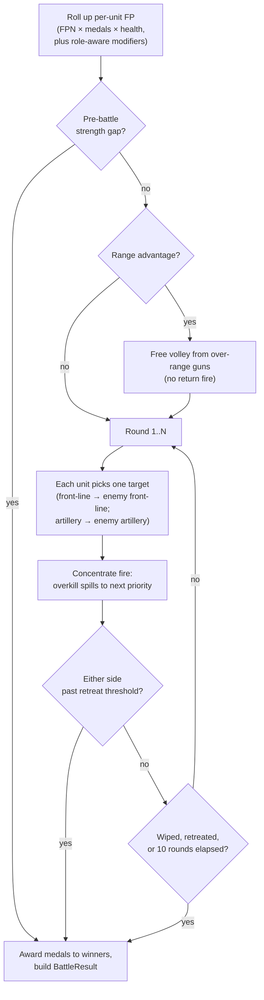

# Combat System

How land battles resolve in the current build.

The authoritative implementation is `crates/domain/src/military/combat.rs`.
The AI's pre-fight estimator (which the AI uses to decide whether to
attack or retreat) lives in `crates/domain/src/military/strength.rs` and
shares the same `GameConfig` knobs so it stays in sync with the resolver.

---

## The big picture

A battle is a quick series of exchanges, not an HP-bar slugfest. Each
unit picks one enemy target per round and damages it by its individual
firepower. Front-line units target the enemy front-line first; artillery
targets enemy artillery first. Damage spills to the next priority target
on overkill — concentrate fire piles damage on the highest-priority
target until it dies, then continues onto the next.



---

## Targeting: front-line vs artillery

Each shooter has a **preferred row** and falls through if it's empty.

| Shooter | Prefers | Falls through to |
|---------|---------|------------------|
| Infantry, Cavalry, Garrison, Special | Enemy front-line | Enemy artillery |
| Artillery | Enemy artillery | Enemy front-line |

```
┌───────────────────────────────┐
│ ARTY  🎯 🎯 🎯                │ ← targets enemy 🎯 first
│                               │
│ FRONT  ⚔️ ⚔️ 🐎 🐎 ⚔️         │ ← targets enemy ⚔️ first
└───────────────────────────────┘
```

There is **no melee penalty for artillery** — the old "exposed guns
pay ×0.5 FP" rule is gone. Screening emerges naturally: if you bring
guns and no infantry, the enemy front-line will fall through to your
artillery and shred it. Bring a wall, and your guns shoot guns while
your wall absorbs hits.

### Concentrate fire with damage spill

Each side splits into two streams: front-line shooters pool their FP
together, artillery shooters pool theirs together. Each stream picks
the highest-priority alive target in its preferred row and drains its
FP onto that one unit. When the target dies, leftover damage spills to
the next priority target. This means a stack always finishes off
wounded units before moving on — no more "spread thin" damage
divided across N targets.

---

## Per-unit firepower

The resolver computes each unit's "effective firepower" (FP) at battle
start as:

```
FP = FPN × medal_modifier × health_scale
```

| Term | Source | Notes |
|------|--------|-------|
| `FPN` | `scripts/config/units.lua` | Regulars 10, Light Artillery 10, Grenadiers 12, Minutemen 5, … |
| `medal_modifier` | `1 + medals × 0.25` | 0★=1.00, 1★=1.25, 4★=2.00 |
| `health_scale` | `health / 100` | 50% HP unit gives half its FP |

That base FP then has *role-aware* modifiers layered on top.

### Attacker side

| Condition | Effect |
|---|---|
| Cavalry, range 1, FPM > 0, **round 1 only** | Use FPM (mounted FP) instead of FPN — the original game's mounted charge |
| Cavalry, **round 1 only** | Multiply by `combat_cavalry_charge_bonus` (default ×1.25) |

### Defender side

| Condition | Effect |
|---|---|
| Per-side fort | Final pass: side FP × `(1 + effective_fort_bonus)` |
| Per-unit Garrison entrenchment | Flat raw FP added per **alive Garrison-category** unit whose `arrived_turn < current_turn` (≥1 full turn at the province) |

The `× def`, `× (1 + terrain)`, and per-unit `defense_terrain_bonus`
multipliers from the original Imperialism manual were dropped earlier —
fort is the only defender multiplier and a unit's `defense` stat is
currently unused (kept around in case a future rebalance brings back
a per-unit durability term).

### Side aggregates

```
attacker_initial_fp = (Σ attacker_unit_fp_round_1) × general_bonus

defender_initial_fp = (Σ defender_applied_fp) × (1 + fort_bonus) × general_bonus
                    + entrenched_garrisons × garrison_entrenchment_fp
```

`general_bonus` = `1.10 + 0.05 × medals_of_best_general`. 1.0 if no
General is in the stack. `fort_bonus` is `0 / 0.25 / 0.50 / 0.75` for
L0–L3, halved if the attacker has SiegeArtillery or RailroadGuns.

The General bonus is baked into each shooter's per-shot FP at the start
of the round, so the concentrate-fire stream uses the post-bonus value.

---

## Round-by-round damage exchange

The combat loop runs up to **10 rounds**. Each round:

```
                     ┌──────────────────────────────┐
   atk front shots → │  drain onto enemy front-line │ → spill to enemy artillery
                     └──────────────────────────────┘
                     ┌──────────────────────────────┐
   atk arty shots  → │  drain onto enemy artillery  │ → spill to enemy front-line
                     └──────────────────────────────┘
                     (same in mirror for defender)
        ↑                                                      ↓
        └─────  recompute FP from survivors next round  ←──────┘
```

A worked round in ASCII, attacker has 4 front-line units (FP 36 total)
and 0 artillery, defender has 3 front-line + 2 artillery:

```
Round 1:
  attacker front-line shooters → drain 36 FP onto highest-priority
    defender front-line unit. If it has 100 HP, it eats 100 dmg, dies,
    leftover 0 spills (used the whole 36). If FP > 100 HP, surplus
    spills to next def front-line target.
  defender front-line shooters (3 units, e.g. 24 FP) → drain onto atk
    front-line; concentrate, kill one outright, spill onto next.
  defender artillery shooters → fall through to atk front-line (atk
    has no artillery) and pile on more damage there.
  → casualties die, FP recomputes from survivors.
```

Several things happen at the end of each round:

1. Units at health ≤ 0 die immediately and stop contributing next round.
2. **Mid-battle retreat checks**: if either side's current FP drops
   below `(1 − retreat_fp_loss) × initial_fp`, that side retreats and
   takes a +10% damage hit on the way out.
3. Battle ends when one side is wiped, retreats, or 10 rounds elapse.

Pre-battle retreat happens before round 1: each side computes its
"strength" via the AI estimator (`strength.rs`) and bails if the
opponent's strength exceeds its own by the side's `*_retreat_ratio`
(read from the side's Lua personality).

---

## Range first-strike volley

Captures "artillery shoots first":

```
   ┌───────── Attacker ──────────┐         ┌───────── Defender ──────────┐
   │ Light Arty (range 3)  ★★    │         │ Regulars (range 1)          │
   │ Grenadiers (range 1)        │   →     │ Regulars (range 1)          │
   │ Light Arty (range 3)        │         │ Minutemen (range 1)         │
   └─────────────────────────────┘         └─────────────────────────────┘

   max_atk_range = 3, max_def_range = 1, atk wins range advantage
       ↓
   over-range units (range > 1) fire ONE free per-shot volley with raw FPN
   × general bonus × volley_multiplier; defender takes no return fire
       ↓
   each volley shot picks one target using the same row preference as a
   normal round (artillery → enemy artillery first; spill on overkill)
```

- One volley per battle, per side that has range advantage.
- Volley uses raw FPN; same per-shot concentrate-fire targeting as
  normal rounds.

---

## AI strength estimator

`military/strength.rs::force_strength` computes a Lanchester-square
roll-up the AI uses *before* deciding to commit to a fight. It uses the
same FP model the resolver does (charge bonus, garrison entrenchment)
so its prediction approximately matches reality.

```
s(unit) = fp_phase(unit) × √durability × range_factor × health_scale
force_strength = (Σ s(u)) × general_bonus + entrenchment
```

- `durability = 1 + fort_bonus` for defenders, `1.0` for attackers
  (with `√` lift to keep the Lanchester-square interpretation; flip
  `combat_ai_strength_lanchester = false` in game.lua to A/B test
  linear instead).
- `range_factor`: attackers get `1 + coeff × max(0, range − opp_max_range)`,
  capped at +50%. Lets the AI value a 6-range Armour stack over a
  1-range Conscript stack of equivalent FP.
- Garrison entrenchment is added at force level (same gate as the
  resolver: `arrived_turn < current_turn`).

The estimator does not model concentrate-fire targeting — it treats the
side's strength as a Lanchester-summed pool, which is a reasonable
approximation for "should I attack" but is not the source of truth for
who wins. The resolver is.

The pre-attack gate compares `our_strength` vs `their_strength × ratio`
(where `ratio` is the personality's `attack_fp_vs_minor` /
`attack_fp_vs_gp`).

---

## Tunables (`scripts/config/game.lua`)

```
fort_defense_level1      = 0.25
fort_defense_level2      = 0.50
fort_defense_level3      = 0.75
garrison_entrenchment_fp = 3.0     # raw FP per entrenched garrison
terrain_defense_*        = 0.0     # all four terrain values currently zero

combat_first_strike_enabled              = true
combat_first_strike_damage_multiplier    = 1.0
combat_cavalry_charge_bonus              = 0.25
combat_ai_strength_lanchester            = true
combat_ai_strength_range_advantage_coeff = 0.10
combat_ai_strength_range_advantage_cap   = 0.50
```
